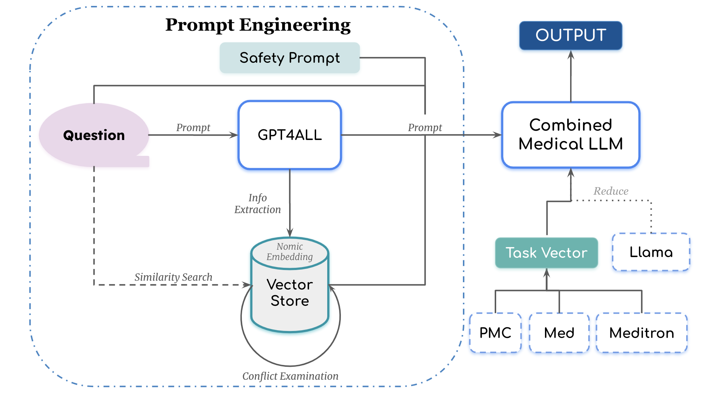

## VitalLink AI: Personalzied Medical Chatbot For All

_This is the project completed for Penn Generative AI Hackathon on Feburary 16-17, 2024. All rights reserved._

**A Chatbot, A Medical Chatbot, A Personalized Medical Chatbot -- Revolutionize your healthcare experience for accessible and efficient support**

**The Presentation can be accessed at:** ([click here](https://docs.google.com/presentation/d/1zf9PiqeRCmtytbm9EB5vno2uXVY50Ur0i96k11m8-0M/edit?usp=sharing))

## 

The primary goal of this project is to develop a personalized medical chatbot that can provide users with personalized medical advice and support. The chatbot is designed to be user-friendly and accessible to everyone. It is capable of providing personalized medical advice and support to users based on their medical history, symptoms, and other relevant information. The chatbot is developed under the notion of "Agents", in which it is built on top of two main components: Retrieval-Augmented Generation (RAG) based on a vector stored in a database and a LLaMA Generative Model specifically trained on medical data. When user input is received, the chatbot will first retrieve relevant information from the the database containing user's medical history and symptoms, and then generate a personalized and informative query for the LLaMA Generative Model. Since LLaMA Generative Model is trained on medical data, it is capable of providing accurate and reliable medical advice and support to users, based on their relevant medical information.  The chatbot is designed to provide instaneous and accurate medical advice and support to users, and it is also at a low cost. The general pipeline of our models is shown below:

This repository contains the following files: 

**RAG_Fracture.ipynd**
This notebook contains the code for the RAG model, which is used to retrieve relevant information from the database, Yearly Medical Examination Report for a Young College Student.pdf, based on user input. We assume that the user enter the symptoms that are related to fracture, and the RAG model will retrieve relevant information from the database based on these symptoms and user's medical history.
- User input: "I have a sharp pain in my arm and I can't move it."
- Retrieved information: "Based on your medical history, the person had a tailbone fracture three years ago due to a snowboarding accident. It was managed with pain medication and physical therapy, with full recovery and no complications." 

**RAG_SkinCancer.ipynd**
This notebook contains the code for the RAG model, and it is another example of the usage of RAG model. The model first retrieve relevant information from the database, Yearly Medical Examination Report for a Middle-aged Woman.pdf, based on user input. We assume that the user enter the symptoms that are related to skin cancer, and the RAG model will retrieve relevant information from the database based on these symptoms and user's medical history.
- User input: "I have a mole on my skin that is growing and changing color."
- Retrieved information: "Based on your medical history, she has been diagnosed with osteopenia and basal cell carcinoma (skin cancer), both of which are being managed with supplementation and regular monitoring. Her cholesterol levels have improved since the previous year, but she still needs to continue taking calcium and vitamin D supplements for her bone density." 

##
This RAG model is built on top of the Nomic Emeddings and GPT4ALL Generative Model developed by [NomicAI](https://www.nomic.ai/), credit to the Nomic team for the open-source code.

**[vitalinkAI.py](vitalinkAI.py)**
This is the main interface for the chatbot. This python file contains the code for the LLaMA Generative Model, which is specifically trained on medical data. The model is capable of providing accurate and reliable medical advice and support to users, based on their relevant medical information. The model is built on top of LLaMA-2 7b, and it is implemented using the Hugging Face's Transformers library. Also, the model is modified by a techique proposed in the paper of "Editing Models with Task Arithmetic" by [Gabriel Ilharco, Marco Tulio Ribeiro, Mitchell Wortsman, Suchin Gururangan, Ludwig Schmidt, Hannaneh Hajishirzi, Ali Farhadi](https://arxiv.org/abs/2212.04089), which is used to improve the model's performance by combining three LLaMA-2 7b models trained on different medical data. The specific implementation of this modification can be found in the `task_vector.py` file.

**[task_vector.py](task_vector.py)**
This python file contains the code for the technique proposed in the paper of "Editing Models with Task Arithmetic". The technique is used to improve the performance of the LLaMA Generative Model by combining three LLaMA-2 7b models trained on different medical data. The technique is implemented by adding the difference of parameters of these three models together. The new model is capable of providing more accurate and reliable medical advice and support to users, based on their relevant medical information.

##
People who contribute to this project: Binbin Chen (chenbb@seas.upenn.edu), Guangyao Dou (gydou@seas.upenn.edu), 
Yiming Wang (yimiwang@seas.upenn.edu), Chenkang Zhang (stezhang@seas.upenn.edu).

## Acknowledgement
We thank Nomic AI team for open-sourcing their code and providing the Nomic Embeddings and GPT4ALL Generative Model. We also thank
Penn's NLP High Performance Computing Group for providing the computing resources for training the LLaMA Generative Model. We also thank the Penn Generative AI Hackathon for providing the resources to develop this project.
